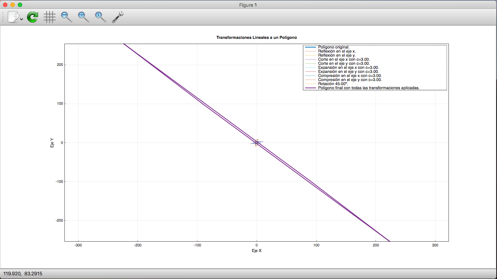
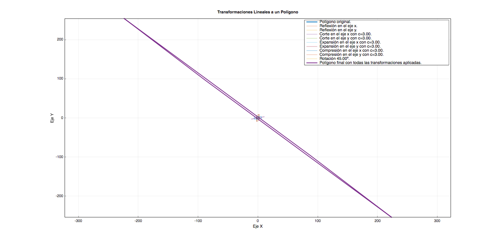

# Programa 6

Programa que, a partir de un polígono, realiza transformaciones lineales sobre éste y muestra los resultados de forma gráfica.

## Instalación

El programa está escrito en C++17, por lo que se requiere un compilador compatible con el estándar C++17 o posterior.

Para la parte de graficación, el programa requiere la instalación de la librería `matplotplusplus`, cuya documentación e instalación se puede consultar en la siguiente liga: [https://alandefreitas.github.io/matplotplusplus/](https://alandefreitas.github.io/matplotplusplus/).

Se anexa un script de ejecución y compilación para simplificar dichas tareas ya que descompuse mi código en varios
archivo sfuente para poder tener flexibilidad de implementación, además de que en este programa se emplean ya librerías que se desarrollaron
para programas anteriores.

Si se quiere realizar la compilación manual, el comando sería:

```bash
g++ -std=c++17 main.cpp ./Librerias/*.cpp -o Programa6.out -lmatplot
```

Con lo cual tendremos nuestro binario `Programa6.out` el cuál podemos ejecutar usando:

```bash
./Programa6.out
```

### Matplotplusplus

Esta es la librería que se utiliza para la graficación y, como se puede ver en la línea de compilación, se requiere tener instalada para poder hacer el ligado (linking, en inglés) de la misma para que se puedan utilizar las funcionalidades de graficación del programa.

Para instalar, la [página de instalación](https://alandefreitas.github.io/matplotplusplus/) nos muestra distintas opciones, pero se sugiere compilarla desde el código fuente para obtener el mejor rendimiento en ejecución local.

Sin esta librería, el programa **no compilará**, por lo que se recomienda asegurarse de que se encuentre instalada localmente antes de intentar compilar el programa.

### Usar el script `compilar-y-ejecutar.sh`

Si se desea, se incluye el script `compilar-y-ejecutar.sh` con el cual se puede realizar la compilación y ejecución del código de forma directa.

## Ejecución

La ejecución del programa es muy simple e intuitiva, pero podría mejorar en su interacción con el usuario para volverlo más simple, por ahora la salida sería:

```txt
Graficador de Transformaciones Lineales sobre un polígono
Escuela Superior de Cómputo - Instituto Politécnico Nacional
Dr. Dárwin Gutiérrez Mejía - Álgebra Lineal

Alumno: Humberto Alejandro Ortega Alcocer (2016630495) <hortegaa1500@alumno.ipn.mx>
Programa: 6

Ingrese el número de puntos en el polígono:
> 4

A continuación, ingrese cada coordenada del polígono separando x de y por un espacio:

         Ejemplo: -12.3 34.3
  Coordenadas punto #1: -2 -3
  Coordenadas punto #2: -2 2
  Coordenadas punto #3: 2 3
  Coordenadas punto #4: 2 -2

Transformaciones disponibles:

  1) Reflexión en eje x.
  2) Reflexión en eje y.
  3) Corte en eje x.
  4) Corte en eje y.
  5) Expansión en eje x.
  6) Expansión en eje y.
  7) Compresión en eje x.
  8) Compresión en eje y.
  9) Rotación.
  -
  10) Continuar con las transformaciones seleccionadas.

Ingrese la opción para aplicar la transformación, o 10 para continuar:
[1-10]> 1

Transformaciones disponibles:

  1) Reflexión en eje x.
  2) Reflexión en eje y.
  3) Corte en eje x.
  4) Corte en eje y.
  5) Expansión en eje x.
  6) Expansión en eje y.
  7) Compresión en eje x.
  8) Compresión en eje y.
  9) Rotación.
  -
  10) Continuar con las transformaciones seleccionadas.

Ingrese la opción para aplicar la transformación, o 10 para continuar:
[1-10]> 2

Transformaciones disponibles:

  1) Reflexión en eje x.
  2) Reflexión en eje y.
  3) Corte en eje x.
  4) Corte en eje y.
  5) Expansión en eje x.
  6) Expansión en eje y.
  7) Compresión en eje x.
  8) Compresión en eje y.
  9) Rotación.
  -
  10) Continuar con las transformaciones seleccionadas.

Ingrese la opción para aplicar la transformación, o 10 para continuar:
[1-10]> 3
Ingrese el valor para c: 3

Transformaciones disponibles:

  1) Reflexión en eje x.
  2) Reflexión en eje y.
  3) Corte en eje x.
  4) Corte en eje y.
  5) Expansión en eje x.
  6) Expansión en eje y.
  7) Compresión en eje x.
  8) Compresión en eje y.
  9) Rotación.
  -
  10) Continuar con las transformaciones seleccionadas.

Ingrese la opción para aplicar la transformación, o 10 para continuar:
[1-10]> 4
Ingrese el valor para c: 3

Transformaciones disponibles:

  1) Reflexión en eje x.
  2) Reflexión en eje y.
  3) Corte en eje x.
  4) Corte en eje y.
  5) Expansión en eje x.
  6) Expansión en eje y.
  7) Compresión en eje x.
  8) Compresión en eje y.
  9) Rotación.
  -
  10) Continuar con las transformaciones seleccionadas.

Ingrese la opción para aplicar la transformación, o 10 para continuar:
[1-10]> 5
Ingrese el valor para c: 3

Transformaciones disponibles:

  1) Reflexión en eje x.
  2) Reflexión en eje y.
  3) Corte en eje x.
  4) Corte en eje y.
  5) Expansión en eje x.
  6) Expansión en eje y.
  7) Compresión en eje x.
  8) Compresión en eje y.
  9) Rotación.
  -
  10) Continuar con las transformaciones seleccionadas.

Ingrese la opción para aplicar la transformación, o 10 para continuar:
[1-10]> 6
Ingrese el valor para c: 3

Transformaciones disponibles:

  1) Reflexión en eje x.
  2) Reflexión en eje y.
  3) Corte en eje x.
  4) Corte en eje y.
  5) Expansión en eje x.
  6) Expansión en eje y.
  7) Compresión en eje x.
  8) Compresión en eje y.
  9) Rotación.
  -
  10) Continuar con las transformaciones seleccionadas.

Ingrese la opción para aplicar la transformación, o 10 para continuar:
[1-10]> 7
Ingrese el valor para c: 3

Transformaciones disponibles:

  1) Reflexión en eje x.
  2) Reflexión en eje y.
  3) Corte en eje x.
  4) Corte en eje y.
  5) Expansión en eje x.
  6) Expansión en eje y.
  7) Compresión en eje x.
  8) Compresión en eje y.
  9) Rotación.
  -
  10) Continuar con las transformaciones seleccionadas.

Ingrese la opción para aplicar la transformación, o 10 para continuar:
[1-10]> 8
Ingrese el valor para c: 3

Transformaciones disponibles:

  1) Reflexión en eje x.
  2) Reflexión en eje y.
  3) Corte en eje x.
  4) Corte en eje y.
  5) Expansión en eje x.
  6) Expansión en eje y.
  7) Compresión en eje x.
  8) Compresión en eje y.
  9) Rotación.
  -
  10) Continuar con las transformaciones seleccionadas.

Ingrese la opción para aplicar la transformación, o 10 para continuar:
[1-10]> 9
¿En cuántos grados desea realizar la rotación?
> 45

Transformaciones disponibles:

  1) Reflexión en eje x.
  2) Reflexión en eje y.
  3) Corte en eje x.
  4) Corte en eje y.
  5) Expansión en eje x.
  6) Expansión en eje y.
  7) Compresión en eje x.
  8) Compresión en eje y.
  9) Rotación.
  -
  10) Continuar con las transformaciones seleccionadas.

Ingrese la opción para aplicar la transformación, o 10 para continuar:
[1-10]> 10
Se aplicarán las transformaciones seleccionadas y serán graficadas en el orden que fueron seleccionadas.

Se mostrará una gráfica en una ventana emergente.

Press ENTER to continue...

¡Gracias por utilizar este programa!

```

La ventana resultante de esta ejecución es:



Y la gráfica correspondiente, al ser exportada a imagen es:



## Conclusión

En este programa pude concretar mis esfuerzos de desarrollar la librería para operaciones generales de Álgebra Lineal así como la graficación de los polígonos con las transformaciones planteadas por el usuario. Estoy muy contento de poder haber logrado todos los objetivos de este programa y de contar con la librería para realizar operaciones de forma rápida y fácil.

Si bien, para esta última parte se requiere de la instalación de una librería externa `matplotpluplus` para realizar la compilación, esta librería se encuentra disponible de forma pública en GitHub por lo que cualquiera debe ser capaz de incluirla en su sistema para poder llevar a cabo la ejecución del programa.

Para las transformaciones, se realizaron de forma genérica por coordenada por lo que se pueden aplicar múltiples ocasiones en caso de que así se requiera, y se muestra cada una aplicada de forma individual y, finalmente, la gráfica del polígono con todas las transformaciones aplicadas.

Estoy muy contento de poder haber trabajado en esta parte práctica de Álgebra Lineal y de haber desarrollado la presente librería, espero revisitarla en algún futuro y complementarla aún más.

## Alumno

Humberto Alejandro Ortega Alcocer
2016630495
Correo: [hortegaa1500@alumno.ipn.mx](mailto:hortegaa1500@alumno.ipn.mx)

Semestre: Septiembre 2020 - Febrero 2021

20 de Enero del 2021
